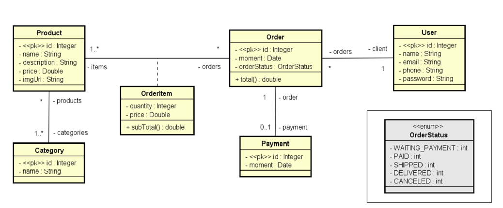

# 💻 Backend Quero Comida

A api foi desenvolvida durante um curso do professor [Nelio](https://github.com/acenelio) como prática para conceitos de api 
rest com utilização do ecossistema spring. 

**Atenção**: Você precisa ter o java jdk 11 instalado na sua máquina bem como o `PATH_VARIABLE` do java configurado e uma IDE de sua preferência.

**O backend está setado em modo de teste, dessa forma, não é necessário nenhum tipo de 
configuração para banco de dados, pois está sendo utilizado o banco de dados em memória (H2).**

**Caso queira utilizar o modo de desenvolvimento, é necessário ter o postgresql instalado e 
configurado na sua máquina. Troque em `./src/main/resources/application.properties`, `spring.profiles.active=dev` 
por `spring.profiles.active=test`.**

Execute o comando: `mvn install` para instalar as dependências do maven.

Após baixar as dependências, execute a aplicação e a api estará rodando em http://localhost:8080.

Acesso ao banco de dados **H2**: `http://localhost:8080/h2-console`.

## 🗺️ Diagrama de Classes - Modelo de Domínio



## 📌 Endpoints

Os seguintes endpoints estão configurados:

### Products
- `/products` - GET - Exibe todos os produtos com suas categories que estejam cadastrados na API.
- `/products/{id}` - GET - Exibe um produto específico e sua(s) categoria(s) através do seu Id.

### Categories
- `/categories` - GET - Exibe todas as categorias cadastradas na API.
- `/categories/{id}` - GET - Exibe uma categoria específica através do seu Id.

### Orders
- `/orders` - GET - Exibe todas os pedidos cadastrados na API.
- `/orders/{id}` - GET - Exibe um pedido específico através do seu Id.

### Users
- `/users` - GET - Exibe todos os usuários cadastrados na API.
- `/users/{id}` - GET - Exibe um usuário específico através do seu Id.
- `/users/{id}` - DELETE - Remove um usuário a partir do seu Id.
- `/users` - POST - Cria um usuário.
- `/users` - PUT - Atualiza as informações de um usuário (Nome, email, telefone).

**Exemplo de dados para criar um Usuário (JSON)**

```json
{
  "name": "any_name",
  "email": "any_email@email.com",
  "phone": "9999-8888",
  "password": "any_password"
}
```

**Exemplo de dados para atualizar um Usuário (JSON)**

```json
{
  "name": "any_name_edit",
  "email": "any_email_edit@email.com",
  "phone": "9999-8888"
}
```

## 🛠️ Ferramentas
1. Java
2. Spring Web
3. Spring Data JPA
4. Spring Boot DevTools   
5. H2 database
6. Postgresql

## 💾 Dados para povoar a api
O arquivo em `src/main/config` é um arquivo de configuração para o povoamento de dados na API. 
Na medida em que a aplicação é inicializada, os dados vão sendo inseridos graças a anotação 
**@PostConstruct**.